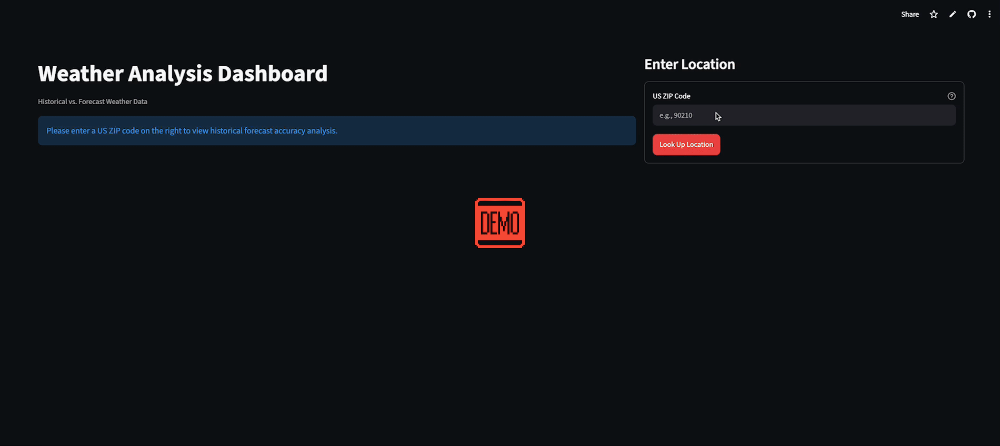
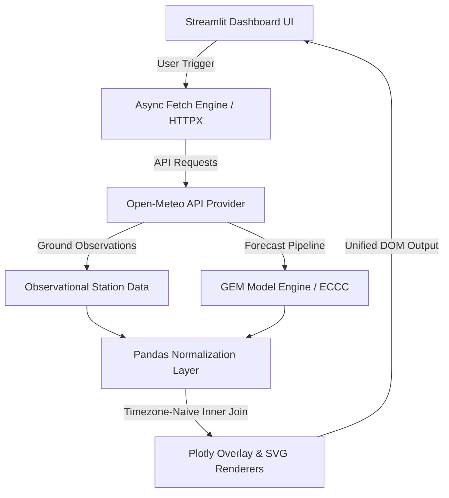

# 🌤️ Streamlit Weather Analysis & GEM Model Audit Dashboard

A high-performance weather audit platform that **evaluates Canadian Meteorological Centre (GEM) forecast accuracy against ground-truth observational data via Open-Meteo**.

  

---

## 🚀 Live Demo & Key Links

- **Live Application**: https://weather-forecast-audit-4pcmlfortybbfqbhmbtbhk.streamlit.app/
- **Source Repository**: https://github.com/Reppiks/weather-forecast-audit

---

## 🎯 The Problem & Solution

### The Challenge

Validating numerical weather prediction (NWP) models like the Canadian GEM requires fine-grained temporal auditing. Traditional weather interfaces aggregate or smooth precipitation data, masking model discrepancies like false-positive precipitation flags, under-predicted rainfall totals, or front-arrival timing offsets across 168-hour rolling windows.

### The Solution

This dashboard provides an audit-first visual verification interface. By combining dual-axis overlay charts that retain explicit zero-value observations with pixel-aligned custom SVG components, it enables meteorologists and data analysts to instantly audit model precision without interface layout shifts or data loss.

---

## 🛠️ Tech Stack & Architecture

### Frontend & UI Layout

- **Framework**: Streamlit 1.35+
- **Data Visualization**: Plotly Python (Dual-Axis Overlay Engine)
- **Custom Components**: Inline SVG & CSS Flexbox (Pixel-Aligned Badges)

### Backend & Data Pipeline

- **Runtime / Language**: Python 3.10+
- **Data Engineering**: Pandas (Naive Datetime Alignment & Time-Series Normalization)
- **Networking & API**: HTTPX (Asynchronous Data Retrieval) & Open-Meteo API

### DevOps & Tooling

- **Package Management**: uv (Fast environment resolution & deterministic locking)
- **Task Runner**: poethepoet (Standardized task execution via pyproject.toml)
- **Code Quality**: Ruff (Linter & Formatter)
- **Hosting**: Streamlit Community Cloud

---

## ✨ Key Features & Engineering Highlights

- **Zero-Loss Data Auditing**: Retains complete precipitation datasets—including explicit 0.00 in records—to ensure full transparency during hover inspections.
- **Dense Overlay Visualization**: Leverages Plotly barmode="overlay" on secondary axes to stack 168 hours of actual vs. forecast precipitation without horizontal crowding or layout distortion.
- **Pixel-Aligned SVG Badges**: Replaces standard iframe embeds with math-generated SVG strings rendered in native st.markdown, unifying container box-models and fixing vertical misalignment.
- **Timezone-Naive Normalization Engine**: Converts asynchronous Open-Meteo data streams into timezone-naive local datetimes to execute exact hourly inner joins across disparate observation sources.
- **Modern Developer Ergonomics**: Configured with pyproject.toml script definitions for standardized linting, formatting, and execution workflows.

---

## 📐 System Architecture

---

## ⚡ Getting Started

### Prerequisites

- Python 3.10 or higher
- uv package manager installed on your system:
  macOS / Linux:
  curl -LsSf https://astral.sh/uv/install.sh | sh

  Windows:
  powershell -c "irm https://astral.sh/uv/install.ps1 | iex"

### Installation & Local Setup

1. Clone the repository:
   git clone https://github.com/Reppiks/weather-forecast-audit.git

2. Sync dependencies:
   uv sync

3. Launch the local development server:
   uv run poe run
   (The application will open automatically at http://localhost:8501)

---

## 🧪 Code Quality & Task Execution

This project uses poethepoet configured within pyproject.toml to standardize common development scripts:

# Run the Streamlit application

uv run poe run

# Lint the codebase against PEP 8 and Ruff conventions

uv run poe lint

# Automatically resolve fixable lint issues

uv run poe fix

# Format all code files

uv run poe format

---

## 📊 Data Sources & Attribution

- **Forecast Model Engine**: GEM (Global Environmental Multiscale) model, produced by Environment and Climate Change Canada (ECCC) [https://www.canada.ca/en/environment-climate-change.html].
- **API & Data Delivery**: Weather data, historical observations, and model access provided via the Open-Meteo API [https://open-meteo.com/] under CC BY 4.0.

---

## 💡 Lessons Learned & Future Roadmap

### What I Learned

- **DOM Alignment in Streamlit**: Resolved height mismatches caused by Streamlit's st.components.v1.html iframe wrapper by moving to raw base64-encoded SVG data strings inside st.markdown(..., unsafe_allow_html=True).
- **Plotly Bar Grouping Overhead**: Fixed visualization compression issues by moving from grouped bar layouts to barmode="overlay" with explicit opacity layering (0.6 actual vs. 0.4 forecast).

---

## 🤝 Contact & Connect

- **LinkedIn**: https://www.linkedin.com/in/alancarrprofile/
- **Email**: email.reppiks@gmail.com
